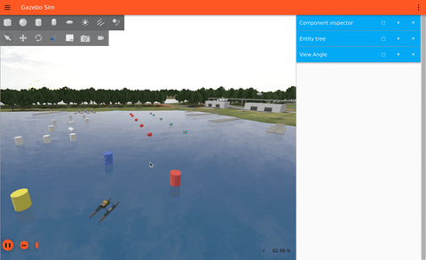

# KABOAT 자율주행 시스템 빠른 시작 가이드

## 개요

KABOAT 자율주행 시스템은 VRX 시뮬레이터에서 WAM-V 보트를 자율 운항합니다.

## 구성요소

```
┌─────────────────────────────────────────────────────────────┐
│                  Integrated Visualizer                       │
│  ┌─────────────────────┐  ┌─────────────────────┐           │
│  │    Global Map       │  │     Polar Map       │           │
│  │  - 보트 위치/궤적    │  │  - LiDAR 데이터     │           │
│  │  - 클릭→목적지 설정  │  │  - 안전 구역        │           │
│  │  - LiDAR (글로벌)   │  │  - 명령 방향        │           │
│  └─────────────────────┘  └─────────────────────┘           │
└─────────────────────────────────────────────────────────────┘
                              │
                              ▼
┌─────────────────────────────────────────────────────────────┐
│                    Mission Runner                            │
│  - GPS/IMU/LiDAR 수신 → 경로 계획 → 명령 발행               │
└─────────────────────────────────────────────────────────────┘
                              │
                              ▼
┌─────────────────────────────────────────────────────────────┐
│                   Motor Controller                           │
│  - PD 제어 → 차동 스러스터 제어                              │
└─────────────────────────────────────────────────────────────┘
                              │
                              ▼
┌─────────────────────────────────────────────────────────────┐
│                 VRX Simulator (Gazebo)                       │
└─────────────────────────────────────────────────────────────┘
```

## 실행 방법

### 0. 빌드 (코드 수정 후 매번 필요, 터미널 아무 곳에서나)

이 패키지는 symlink-install이 아니라 일반 install이라, `mission_runner.py` / `config/settings.py` /
`controllers/*.py` 등을 고치면 **`ros2 run`/`ros2 launch` 전에 반드시 재빌드**해야 반영된다.

```bash
source /opt/ros/humble/setup.bash
cd ~/vrx_ws
colcon build --packages-select kaboat_autonomous
source install/setup.bash
```

> ⚠️ **워크트리 주의**: 실제 빌드는 `~/vrx_ws/src/kaboat_autonomous` (colcon 워크스페이스에 물린 git worktree)에서
> 이루어진다. Claude Code 등 다른 위치(`.../orca/workspaces/kaboat_autonomous/bonito` 등)에서 작업한
> 커밋되지 않은 변경분은 `~/vrx_ws/src/kaboat_autonomous` 쪽에 반영되어 있어야 빌드에 잡힌다
> (같은 브랜치를 커밋/체크아웃으로 동기화하거나, 직접 `~/vrx_ws/src/kaboat_autonomous`에서 편집).

### 1. 시뮬레이션 시작 (터미널 1)

```bash
source /opt/ros/humble/setup.bash
source ~/vrx_ws/install/setup.bash
ros2 launch kaboat_pkg kaboat_sim.launch.py
```

### 2. 자율주행 시스템 시작 (터미널 2) - 권장: 올인원 launch

`autonomous.launch.py`는 센서 브릿지 + 스러스터 브릿지 + `motor_controller` + `mission_runner` +
`integrated_visualizer` + 보트 릴리즈(5초 후)까지 **한 번에** 띄운다. 아래 3번(개별 시각화)은
이 launch를 쓰지 않고 노드를 하나씩 띄울 때만 추가로 실행한다 (같이 쓰면 시각화 창이 중복 실행됨).

```bash
source /opt/ros/humble/setup.bash
source ~/vrx_ws/install/setup.bash
ros2 launch kaboat_autonomous autonomous.launch.py
```

### 3. (선택) 개별 노드로 실행 - 디버그용

올인원 launch 대신 노드를 하나씩 띄우고 싶을 때 (예: 특정 노드만 재시작하며 디버깅):

```bash
source /opt/ros/humble/setup.bash
source ~/vrx_ws/install/setup.bash

# 센서 브릿지 (GZ → ROS)
GZ_IP=<본인 IP> ros2 launch kaboat_autonomous sensor_bridge.launch.py

# 모터 컨트롤러 (PD 제어)
ros2 run kaboat_autonomous motor_controller

# 미션 실행기 (경로계획 + 명령 발행)
ros2 run kaboat_autonomous mission_runner

# 통합 시각화 (Global/Polar Map, 웨이포인트 클릭, 튜닝 슬라이더)
ros2 run kaboat_autonomous integrated_visualizer
```

## 시각화 사용법

### Global Map (왼쪽)
- **보트 위치**: 빨간 점
- **이동 궤적**: 파란 선
- **헤딩 방향**: 초록 선
- **LiDAR**: 파란 점들
- **클릭**: 해당 위치로 목적지 설정

### Polar Map (오른쪽)
- **LiDAR 데이터**: 파란 점 (극좌표)
- **안전 구역**: 반투명 파란 영역
- **전방**: 초록 선 (0°)
- **명령 방향**: 빨간 선 (psi_error)
- **스러스터 상태**: 하단 텍스트 (L/R)

## 토픽 구조

| 토픽 | 타입 | 설명 |
|------|------|------|
| `/wamv/sensors/gps/fix` | NavSatFix | GPS 위치 |
| `/wamv/sensors/imu/data` | Imu | IMU 데이터 |
| `/wamv/sensors/lidar/scan` | LaserScan | LiDAR 스캔 |
| `/command` | Float32MultiArray | [psi_error, tau_x, max_sat, goal_psi] |
| `/wamv/thrusters/left/thrust` | Float64 | 왼쪽 스러스터 |
| `/wamv/thrusters/right/thrust` | Float64 | 오른쪽 스러스터 |
| `/waypoint_goal` | PointStamped | 시각화 클릭 웨이포인트 |
| `/tuning_params` | Float32MultiArray | [BOAT_WIDTH, AVOID_RANGE, GAIN_PSI, GAIN_DISTANCE, GOAL_RANGE] - 슬라이더 실시간 튜닝 |
| `/maneuver_cmd` | String (JSON) | 기동 모듈 트리거: backward/dorodori/hover/orbit/midpoint/stop |

## 파라미터 조정

`config/settings.py`의 기본값 (2026-08-25 기준):

```python
# 자율주행 파라미터
BOAT_WIDTH = 2.5       # WAM-V 폭 (m)
AVOID_RANGE = 25.0     # 장애물 회피 거리 (m)
GAIN_PSI = 1.0         # 목적지 각도 가중치
GAIN_DISTANCE = 1.5    # 거리 가중치
GOAL_RANGE = 3.0       # 웨이포인트 도착 판정 거리 (m)

# PD 제어 (VRX 스러스터 velocity_control=true, 각속도 rad/s 입력)
KP = 100.0             # 비례 계수
KD = 12.0              # 미분 계수
MAX_THRUST = 500.0     # 최대 각속도 (rad/s)
```

파일을 고치면 재빌드(`colcon build --packages-select kaboat_autonomous`) 후 재실행해야 반영된다.
**재빌드 없이 즉시 반영**하고 싶으면 `integrated_visualizer` 또는 `visualize_local` 창의 슬라이더를
움직이면 `/tuning_params`로 발행되어 `mission_runner`가 즉시 `SETTINGS`에 적용한다 (프로세스 종료 시
사라지는 임시 값이므로, 마음에 든 값은 `config/settings.py`에 직접 반영해야 영구 저장됨).

## 화면 없이(헤드리스) 웨이포인트/스러스터 명령으로 검증

시각화 창을 클릭할 수 없는 환경(SSH, CI 등)에서 동작을 확인할 때:

```bash
# 웨이포인트 지정 (mission_runner가 /waypoint_goal 수신 시 자동 주행 시작)
ros2 topic pub --once /waypoint_goal geometry_msgs/msg/PointStamped \
  "{header: {frame_id: 'map'}, point: {x: 20.0, y: 10.0, z: 0.0}}"

# 실제로 계산되는 조향/추력 명령 확인
ros2 topic echo /command

# 스러스터 출력이 실제로 나가는지 확인
ros2 topic echo /wamv/thrusters/left/thrust
ros2 topic echo /wamv/thrusters/right/thrust

# GPS/IMU/LiDAR가 정상 수신되는지 개별 확인
ros2 topic echo /wamv/sensors/gps/fix --once
ros2 topic echo /wamv/sensors/imu/data --once
ros2 topic echo /wamv/sensors/lidar/scan --once

# 수동 스러스터 테스트 (전진 2초, mission_runner 없이도 동작 확인 가능)
ros2 topic pub /wamv/thrusters/left/thrust std_msgs/msg/Float64 "{data: 100.0}" -r 10 &
ros2 topic pub /wamv/thrusters/right/thrust std_msgs/msg/Float64 "{data: 100.0}" -r 10 &
sleep 2
pkill -f "ros2 topic pub"
```

## 신규 기동 모듈(`maneuvers.py`) 단독 테스트

`controllers/maneuvers.py`의 후진/도리도리/궤도(로이터링)/2점 중점/호버링 5개 함수는 ROS 의존성이
없는 순수 함수라 시뮬레이터·ROS 없이 바로 검증할 수 있다. **반드시 `/usr/bin/python3`(ROS Humble이
빌드된 3.10) 사용** - linuxbrew 등 다른 python은 `controllers/__init__.py`가 끌어오는 `rclpy` import에서
깨진다.

```bash
cd ~/vrx_ws/src/kaboat_autonomous   # 또는 편집 중인 워크트리 경로
/usr/bin/python3 -c "
import sys; sys.path.insert(0, 'kaboat_autonomous'); sys.path.insert(0, '.')
from controllers.autonomous_module import Boat
from controllers import maneuvers as M

b = Boat(position=[0,0], psi=45.0, scan=[0.0]*360)
print('backward:', M.backward(b, thrust=100, hold_heading=45))
print('dorodori:', M.dorodori(b, center_heading=90, half_range_deg=30, t=2, period_sec=8))

scan = [0.0]*360; scan[10] = 5.0; scan[350] = 5.0
b2 = Boat(position=[0,0], psi=0.0, scan=scan)
print('midpoint:', M.midpoint_waypoint_from_scan(b2, 10, 350))

scan2 = [0.0]*360; scan2[0] = 20.0
b3 = Boat(position=[0,0], psi=0.0, scan=scan2)
print('orbit cw:', M.plan_orbit(b3, 0, radius=5.0, direction='cw', n_points=8))

print('hover (target ahead):', M.hover(b, 5.0, 0.0, deadband=0.5))
"
```

## 기동 모듈을 시뮬레이터에서 직접 실행 (배선 완료, 2026-08-25 5개 전부 실측 검증)

`mission_runner.py`에 `/maneuver_cmd`(std_msgs/String, JSON) 토픽으로 배선되어 있다. `backward`/
`dorodori`/`hover`는 매 tick 연속 제어되는 모드로 동작하고, `orbit`/`midpoint`는 웨이포인트만 계산해
장애물회피에서 이미 검증된 `pathplan()` 웨이포인트 추종 모드로 넘긴다 - 즉 회피 시 PWM은 항상
`pathplan()` 기준을 그대로 따른다. 추력 크기 등 기본값은 전부 `config/settings.py`의
`MAX_FORWARD_THRUST` 비율로 정의되어 있어 `pathplan()`과 동일한 보트 동역학 튜닝을 공유한다
(`BACKWARD_THRUST`, `HOVER_MAX_THRUST`, `DORODORI_*`, `ORBIT_*`).

### ⚠️ "Waiting for at least 1 matching subscription(s)..."가 안 끝날 때

이건 `mission_runner`가 **아예 안 떠 있다**는 뜻이다 (`/maneuver_cmd`를 구독하는 노드가 없으면 발행이
영원히 대기함). 원인은 거의 항상 둘 중 하나:

1. `autonomous.launch.py`를 아직 안 띄웠거나, 띄운 뒤 코드를 고쳐서 **재빌드는 했지만 프로세스를
   재시작 안 함** - symlink-install이 아니라 실행 중인 프로세스에는 재빌드가 반영되지 않는다.
2. 편집한 워크트리(`bonito` 등)와 실제 빌드되는 `~/vrx_ws/src/kaboat_autonomous`가 **다른 디렉토리**라
   변경사항이 애초에 빌드에 안 잡혔음.

확인 순서:

```bash
ros2 node list | grep mission_runner        # 안 뜨면 launch부터
ros2 topic info /maneuver_cmd                # Subscription count: 1 이어야 정상 (0이면 노드 재시작 필요)
ps aux | grep mission_runner                 # 프로세스 시작 시각이 최신 빌드보다 이전이면 kill 후 재실행
```

옛 프로세스가 떠 있다면:

```bash
pkill -f "lib/kaboat_autonomous/mission_runner"
pkill -f "lib/kaboat_autonomous/motor_controller"
# 그다음 autonomous.launch.py 다시 실행
```

### 실측 검증 결과 (GIF, 실제 시뮬레이터에서 캡처)

아래 5개는 전부 시뮬레이터를 직접 띄운 상태로 `/maneuver_cmd`를 실행하고, `/command`(psi_error/tau_x)와
`/waypoint` 값을 동시에 로깅해서 실제로 의도대로 동작하는지 확인한 결과다. GIF는
`docs/media/maneuvers/`에 있다.

| 기동 | 명령 | 실측 확인 |
|------|------|----------|
| 후진 | `backward` | `tau_x=-200.0` (역추진), `psi_error≈3.4°` (헤딩 유지)  |
| 도리도리 | `dorodori` | `psi_error`가 6.6°→13.9°(피크)→-15.4°로 사인파 왕복 확인  |
| 호버링 | `hover` | 10초 내내 `tau_x=0.0` - deadband(0.5m) 밖으로 안 벗어나 위치 유지 확인  |
| 궤도(로이터링) | `orbit` | 웨이포인트 `(27.47, 121.61)` 생성, `tau_x=340`(=`BASE_CRUISE_THRUST`, `pathplan()`과 동일 기준), `psi_error` 48.6°→39.5°로 수렴  |
| 2점 중점 | `midpoint` | 웨이포인트 `(18.70, 120.15)` 계산, `psi_error≈-1°`(거의 정조준), `is_clear` 상태에서 거리비례 감속 확인  |

### 명령어

시뮬레이터/`autonomous.launch.py` 실행 중인 상태에서 (위 "구독 확인" 먼저):

```bash
# 후진 3초, 추력 200 지정 (thrust/hold_heading 생략 시 SETTINGS 기본값/현재 헤딩 사용)
ros2 topic pub --once /maneuver_cmd std_msgs/msg/String \
  '{data: "{\"cmd\": \"backward\", \"thrust\": 200, \"duration\": 3}"}'

# 현재 헤딩 기준 ±30도, 주기 8초로 10초간 도리도리
ros2 topic pub --once /maneuver_cmd std_msgs/msg/String \
  '{data: "{\"cmd\": \"dorodori\", \"half_range_deg\": 30, \"period_sec\": 8, \"duration\": 10}"}'

# 현재 위치에서 호버링(위치 유지) 10초
ros2 topic pub --once /maneuver_cmd std_msgs/msg/String \
  '{data: "{\"cmd\": \"hover\", \"duration\": 10}"}'

# 진행 중인 기동 즉시 정지 (waypoint 모드로 복귀 + 스러스터 0)
ros2 topic pub --once /maneuver_cmd std_msgs/msg/String '{data: "{\"cmd\": \"stop\"}"}'

# 실행 중 어떤 명령이 어떻게 해석됐는지 로그로 확인
ros2 topic echo /command    # 실제로 나가는 [psi_error, tau_x, max_sat, goal_psi] 확인
ros2 topic echo /waypoint   # orbit/midpoint가 실제 찍은 웨이포인트 좌표 확인
```

**`orbit`/`midpoint`는 `idx`가 매번 다르다** - `boat.scan`(0~359, LiDAR 각도 컨벤션)에서 실제로 반사가
잡힌 인덱스를 써야 하고, 특히 VRX 시뮬레이터에서는 보트가 계류 해제 직후 관성으로 계속 회전하는
경우가 있어 방향(=인덱스)이 계속 바뀐다. **명령 쏘기 직전에** 아래로 현재 유효한 인덱스를 먼저 확인:

```bash
/usr/bin/python3 -c "
import rclpy, numpy as np
from rclpy.node import Node
from sensor_msgs.msg import LaserScan
rclpy.init(); node = Node('lidar_probe'); result = {}
node.create_subscription(LaserScan, '/wamv/sensors/lidar/scan', lambda m: result.update(msg=m), 10)
import time; t0=time.time()
while 'msg' not in result and time.time()-t0 < 5: rclpy.spin_once(node, timeout_sec=0.2)
r = np.nan_to_num(np.array(result['msg'].ranges), nan=0.0, posinf=0.0)
r = r[np.linspace(0, len(r)-1, 360).astype(int)]           # mission_runner와 동일 리샘플
r[r > 50.0] = 0; r[(r > 0) & (r < 1.0)] = 0                  # 최대거리/자기반사 필터
r = np.roll(r, 180)                                          # 180도 정렬 보정
for i in range(360):
    if r[i] > 0: print(i, round(float(r[i]), 2))
"
```

찾은 idx로:

```bash
# LiDAR scan[idx] 지점 주위를 반경 8m로 시계 궤도(로이터링) - idx는 위에서 찾은 값으로 교체
ros2 topic pub --once /maneuver_cmd std_msgs/msg/String \
  '{data: "{\"cmd\": \"orbit\", \"idx\": 22, \"radius\": 8, \"direction\": \"cw\"}"}'

# LiDAR scan[idx1]과 scan[idx2] 두 점의 중점에 웨이포인트 - idx1/idx2는 위에서 찾은 값으로 교체
ros2 topic pub --once /maneuver_cmd std_msgs/msg/String \
  '{data: "{\"cmd\": \"midpoint\", \"idx1\": 117, \"idx2\": 234}"}'
```

전체 JSON 파라미터는 `mission_runner.py`의 `maneuver_cmd_callback()`과 각 `start_*()` 메서드 참고.

### 실측 캡처 재현 방법 (GIF 재녹화가 필요할 때)

```bash
# Gazebo GUI 창 id 확인
xwininfo -root -tree -display :0 | grep -i "gazebo sim"

# 창 녹화 -> mp4 (WINDOW_ID는 위에서 확인한 값, REC_SEC는 명령 duration + 2~3초 여유)
DISPLAY=:0 ffmpeg -y -f x11grab -window_id <WINDOW_ID> -framerate 10 -t <REC_SEC> -i :0 \
  -vf "scale=640:-1" out.mp4

# mp4 -> gif (팔레트 2-pass, 8fps/480px로 용량 절감)
ffmpeg -y -i out.mp4 -vf "fps=8,scale=480:-1:flags=lanczos,palettegen" -update 1 palette.png
ffmpeg -y -i out.mp4 -i palette.png \
  -filter_complex "fps=8,scale=480:-1:flags=lanczos[x];[x][1:v]paletteuse" out.gif
```

## 문제 해결

rosbridge/ros-mcp-server 연결, `ros_gz_bridge` vs `ros_gzgarden_bridge` 호환성 문제, GZ_IP 설정,
보트 릴리즈 안 될 때 등은 루트 `QUICKSTART.md`의 "문제 해결" 절을 참고.
